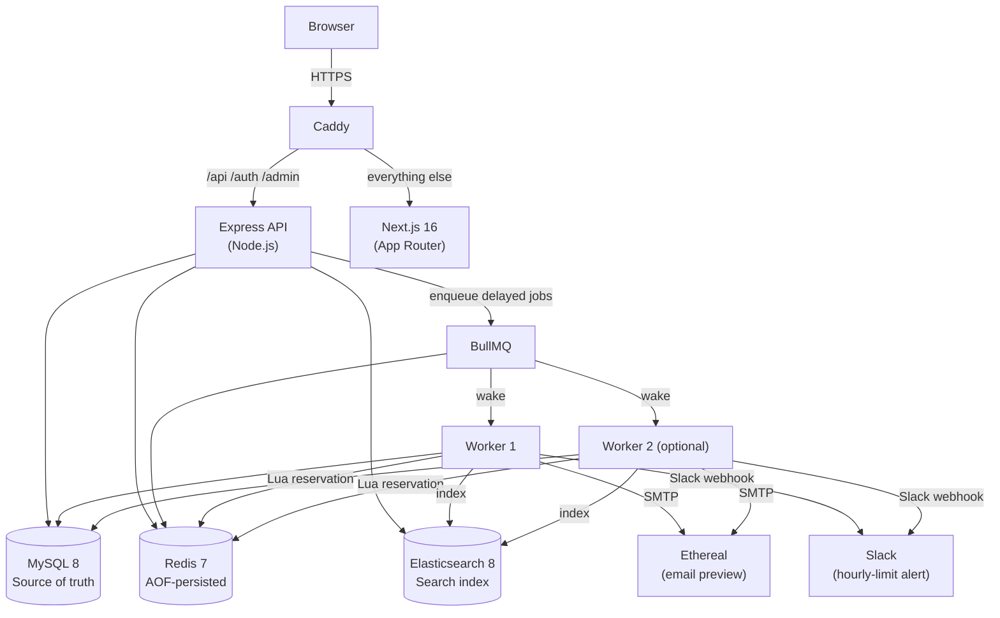

# ReachInbox Email Job Scheduler

[](https://github.com/Purvee25/outbox-email-scheduler/actions/workflows/ci.yml)

A full-stack email scheduling system built to the ReachInbox take-home spec.
Schedule campaigns of up to 5 000 recipients, enforce per-sender hourly limits,
survive restarts with zero duplicates, and search every email via Elasticsearch.

**Contents:** [Architecture](#architecture) · [Local development](#local-development) ·
[Scheduling algorithm](#scheduling-algorithm) · [Worker flow](#worker-flow-per-job) ·
[Restart & recovery](#restart--recovery) · [Behaviour under load](#behaviour-under-load) ·
[API](#api-reference) · [Testing](#testing) · [Features by requirement](#features-by-requirement) ·
[Trade-offs](#assumptions-shortcuts-and-trade-offs) · [Bugs found by testing](#bugs-found-by-testing)

---

## Architecture



### Key design decisions

| Decision                             | Why                                                                                                                                                                                                                                                                                  |
| ------------------------------------ | ------------------------------------------------------------------------------------------------------------------------------------------------------------------------------------------------------------------------------------------------------------------------------------ |
| **MySQL as source of truth**         | Atomic `UPDATE … WHERE status='scheduled'` gives cheap idempotent claiming without a distributed lock library.                                                                                                                                                                       |
| **Redis AOF + BullMQ**               | Jobs survive restarts. On boot the worker reconciles every `scheduled` row that lacks a Redis job — so even a full Redis wipe doesn't lose work.                                                                                                                                     |
| **Lua-script slot reservation**      | One atomic `EVALSHA` per job hands out the next free send-slot and enforces the hourly cap. No polling, no thundering herd.                                                                                                                                                          |
| **`moveToDelayed` instead of sleep** | The worker never blocks a thread. If a slot is in the future it moves the job back to BullMQ's delayed set and exits the processor.                                                                                                                                                  |
| **At-most-once on expired leases**   | Ethereal has no idempotency key. An expired `sending` row is marked `failed` rather than retried — we prefer missing one send to duplicating it.                                                                                                                                     |
| **Rolling-window hourly limit**      | Each sender's last N send times live in a Redis list; a send is never earlier than 1 h after the send N places back, so no 60-minute span exceeds the limit — no 2× burst around `:00`. All of a sender's keys share a `{sender}` hash tag, so the Lua script is Redis Cluster-safe. |
| **Separate notification queue**      | A slow or erroring Slack call never blocks email sending.                                                                                                                                                                                                                            |
| **Elasticsearch for search**         | MySQL `LIKE` on millions of rows is slow. ES failure only delays search results — email sending continues unaffected.                                                                                                                                                                |
| **Session cookie, not JWT**          | Real logout/revocation. `httpOnly` + `SameSite=Lax` + `secure` in production.                                                                                                                                                                                                        |
| **Google OAuth as the only login**   | Spec requirement; no password storage.                                                                                                                                                                                                                                               |

---

## Monorepo layout

```
outbox-email-scheduler/
├── .github/workflows/ci.yml  Typecheck, lint, tests, build and Docker images on every push
├── packages/shared/          Zod schemas + TypeScript types (API ↔ frontend)
├── backend/
│   ├── src/
│   │   ├── auth/             Google OAuth (PKCE + state)
│   │   ├── config/           Zod-validated env
│   │   ├── db/               Drizzle ORM schema + migrations
│   │   ├── queue/            BullMQ processors (email, maintenance, notifications, search-index)
│   │   ├── scheduling/       Slot planner + Lua reservation script
│   │   ├── search/           Elasticsearch client + index helpers
│   │   ├── services/         Campaign creation, email listing
│   │   ├── slack/            OAuth + webhook encryption + notifications
│   │   ├── admin/            Bull Board router
│   │   ├── middleware/       requireAuth, requireAdmin, CORS origin check, rate limiters
│   │   ├── server.ts         HTTP server entry
│   │   └── worker.ts         Worker process entry
│   └── test/
├── frontend/
│   └── src/
│       ├── app/              Next.js App Router pages (login, dashboard)
│       ├── components/       ui/ + dashboard/ components
│       ├── hooks/            React Query hooks
│       └── lib/              API client
├── scripts/
│   └── load-test.mjs         1 000-email load-test script
├── docker-compose.yml         Local dev infra (MySQL, Redis, ES only)
├── docker-compose.prod.yml    Full production stack + Caddy
└── Caddyfile                  Reverse-proxy config
```

---

## Local development

### 1 · Prerequisites

- Node.js ≥ 20, npm ≥ 10
- Docker + Docker Compose

### 2 · Clone & install

```bash
git clone https://github.com/Purvee25/outbox-email-scheduler
cd outbox-email-scheduler
npm install          # installs all workspaces
```

### 3 · Start infrastructure

```bash
docker compose up -d   # MySQL on :3307, Redis on :6379, Elasticsearch on :9200
```

### 4 · Configure environment

```bash
cp .env.example backend/.env
# Edit backend/.env:
#   SESSION_SECRET  — openssl rand -hex 32
#   ENCRYPTION_KEY  — openssl rand -hex 32
#   GOOGLE_CLIENT_ID / GOOGLE_CLIENT_SECRET — Google Cloud Console
#   SLACK_CLIENT_ID / SLACK_CLIENT_SECRET   — api.slack.com (optional for dev)
#   ETHEREAL_SENDERS — user:pass,user:pass  (create at ethereal.email)
#   ADMIN_EMAILS     — your email (for Bull Board access)
#   MAIL_TRANSPORT   — "log" skips SMTP; "ethereal" sends and generates preview URLs
```

### 5 · Migrate database

```bash
npm run db:migrate -w backend
```

### 6 · Run

```bash
# Terminal 1 — API
npm run dev:api

# Terminal 2 — Worker
npm run dev:worker

# Terminal 3 — Frontend
npm run dev -w frontend   # → http://localhost:3000
```

Bull Board: `http://localhost:4000/admin/queues`

---

## Production deploy (Railway)

See [`docs/railway.md`](docs/railway.md) for the full step-by-step.

Quick summary:

1. Add MySQL, Redis, Elasticsearch add-ons in Railway.
2. Create three Railway services (API, worker, frontend) pointing at this repo.
3. Set all env vars (copy from `.env.example`).
4. Run the migration once: `railway run --service api node --import tsx/esm backend/src/db/migrate.ts`
5. Update Google and Slack OAuth redirect URLs to the Railway-assigned HTTPS URLs.

---

## Production deploy (single VM + Caddy)

```bash
# On the VM
git clone https://github.com/Purvee25/outbox-email-scheduler
cd outbox-email-scheduler
cp .env.example .env.production   # fill every value
# Edit Caddyfile — replace YOUR_DOMAIN with your DuckDNS subdomain

docker compose -f docker-compose.prod.yml --env-file .env.production up -d
# Scale to 2 workers for the demo
docker compose -f docker-compose.prod.yml --env-file .env.production \
  up -d --scale worker=2
```

---

## Data model

```
users            id · google_id · email · name · avatar_url
slack_connections  user_id · webhook_url_enc (AES-256-GCM) · channel · team_name
campaigns        id · user_id · subject · body · start_at · delay_ms · hourly_limit
emails           id · campaign_id · user_id · recipient · sender
                 status (scheduled|sending|sent|failed)
                 scheduled_at · sent_at · message_id · preview_url · error
                 attempts · lease_token · lease_expires_at
```

Unique constraint on `(campaign_id, recipient)` prevents duplicate scheduling.
Index on `(user_id, status, scheduled_at)` keeps paginated list queries fast.

---

## Scheduling algorithm

1. **Campaign creation** (`POST /api/campaigns`): Zod validates the body, deduplicates
   recipients, inserts the campaign and all email rows in one transaction.

2. **Slot assignment at insert time**: For N recipients across S senders,
   email _i_ gets sender `senders[i % S]` and
   `scheduled_at[i] = max(scheduled_at[i-1] + delay, scheduled_at[i - hourlyLimit] + 1h)`.
   The second term is the rolling hourly window: any 60-minute span holds at most
   `hourlyLimit` sends. Order is preserved because times only increase.

3. Each row → BullMQ delayed job with `jobId = "email-<uuid>"`.
   Duplicate `jobId` submissions are silently ignored by BullMQ, so
   re-enqueueing on reconcile is safe.

---

## Worker flow (per job)

```
1. Claim   UPDATE … SET status='sending' WHERE id=? AND status='scheduled'
           0 rows → already handled → complete (idempotent).

2. Reserve Lua EVALSHA: atomically reserve the next free slot for this sender.
           Returns the send timestamp; blocks the slot for exactly one job.
           Last hour already full → slot pushed to 1 h after the oldest counted
           send → Slack alert (deduped per user/sender/hour).

3. Turn    Compare-and-set on the sender's last actual send time.
           Ensures ≥ MIN_DELAY_MS even if the slot maths is off by a few ms.

4. Future? Release claim, save slot in job data, moveToDelayed(ts), throw DelayedError.
           (Never sleeps inside the processor.)

5. Send    Nodemailer → Ethereal SMTP, deterministic Message-ID: <emailId@scheduler.local>.

6. Mark    status='sent' + message_id + preview_url
           On error: 5xx or attempts ≥ MAX → 'failed'; else back to 'scheduled' + BullMQ retry.

7. Index   Upsert into Elasticsearch (failure logged + retried; search degrades gracefully).
```

---

## Restart & recovery

- **Redis AOF** (`appendonly yes`, `appendfsync everysec`) persists all BullMQ data
  across restarts.
- **On worker boot**: every `scheduled` email row without a Redis job is re-enqueued
  with its original `scheduled_at`. Tested: full Redis key deletion, all jobs
  recovered and sent on time.
- **Expired leases** (`sending` rows past `lease_expires_at`): marked `failed`,
  not retried — at-most-once delivery.
- **Lease sweep**: self-rescheduling BullMQ delayed job (no cron).

---

## Behaviour under load

**Test: 1 000 emails, 2 s delay, limit 200/h/sender, 3 senders:**

- Senders are assigned round-robin, so each sender handles ~333 emails.
- With limit 200/h, each sender sends its first 200 two seconds apart; every later send
  waits until one hour after the send 200 places before it. Nothing is dropped or failed.
- The Lua reservation script ensures per-sender FIFO and exact capping over any rolling
  60 minutes, so there is no burst when the clock crosses `XX:00:00`.
- With `--scale worker=2`: both workers pick up jobs, per-sender Lua lock ensures
  no two workers reserve the same slot. `MAX(attempts)` stays 1.

**Verified scenarios (automated tests + manual):**

| Scenario                                | Result                                                   |
| --------------------------------------- | -------------------------------------------------------- |
| 6 emails, 1 s apart                     | All sent 40–120 ms after scheduled time, 1 attempt each  |
| Worker killed, restarted before due     | All sent once                                            |
| Full Redis wipe while worker down       | Worker rebuilt from MySQL on boot, all sent on time      |
| Limit 2, sends at 10:59:59 and 11:00:00 | 3rd held to 11:59:59 — the limit does not reset at `:00` |
| Limit 10, 50 concurrent reservations    | Every 60-minute span holds ≤ 10 sends                    |
| 30 emails at once                       | Per-sender gap 2 006–2 009 ms                            |
| All runs combined                       | 55 sent, 0 duplicates, max attempts 1                    |

---

## API reference

| Method | Path                            | Auth    | Description                                                |
| ------ | ------------------------------- | ------- | ---------------------------------------------------------- |
| GET    | `/health`                       | —       | MySQL + Redis liveness                                     |
| GET    | `/auth/google`                  | —       | Start Google OAuth flow                                    |
| GET    | `/auth/google/callback`         | —       | OAuth callback                                             |
| POST   | `/auth/logout`                  | ✓       | Invalidate session                                         |
| GET    | `/api/me`                       | ✓       | Current user + Slack status                                |
| POST   | `/api/campaigns`                | ✓       | Schedule a campaign                                        |
| GET    | `/api/emails?tab&page&q&status` | ✓       | List/search emails                                         |
| GET    | `/api/emails/:id`               | ✓       | Email detail (owner only)                                  |
| PUT    | `/api/emails/:id/star`          | ✓       | Star / unstar                                              |
| PUT    | `/api/emails/:id/archive`       | ✓       | Archive / unarchive                                        |
| DELETE | `/api/emails/:id`               | ✓       | Delete; cancels it if still scheduled, `409` while sending |
| GET    | `/api/slack/connect`            | ✓       | Start Slack OAuth                                          |
| GET    | `/api/slack/callback`           | ✓       | Slack OAuth callback                                       |
| DELETE | `/api/slack`                    | ✓       | Disconnect Slack                                           |
| GET    | `/admin/queues`                 | ✓ admin | Bull Board                                                 |

---

## Security

- All data queries and ES searches are filtered by `req.session.userId` — no
  cross-user data leakage.
- Slack webhook URLs stored AES-256-GCM encrypted (key never leaves the server).
- Bull Board behind `requireAuth` + `ADMIN_EMAILS` allowlist.
- `helmet`, `CORS` to one origin with credentials, `Origin` check on mutations,
  1 MB body limit, auth and compose rate limits (Redis-backed).
- Email bodies are rich-text HTML sanitised on the server (allow-list of tags, http/https/mailto
  links only) on write _and_ read; list previews are plain text.
- Docker images never contain `.env` files (`.dockerignore`) and run as the non-root `node` user.
- Session cookie: `httpOnly`, `secure` in production, `SameSite=Lax`.

---

## Load test

```bash
node scripts/load-test.mjs \
  --api          https://your-api.railway.app \
  --cookie       "sid=<value from DevTools>"  \
  --count        1000                          \
  --hourly-limit 10                            \
  --delay        2000
```

Emails appear in the dashboard immediately and sends beyond the campaign limit are spread
across later hours. The campaign limit is applied at planning time, so one run never trips the
runtime **per-sender** limit. To see the Slack alert, start the API and worker with
`MAX_EMAILS_PER_HOUR_PER_SENDER=2` and schedule two campaigns back to back: the second one
shares the senders, exceeds their limit, is held (not dropped) and posts the alert.

---

## Testing

```bash
docker compose up -d     # tests run against real MySQL, Redis and Elasticsearch
npm test                 # backend (Vitest + Supertest) and frontend (Vitest + Testing Library)
```

**94 tests** (74 backend, 20 frontend), run on every push by [GitHub Actions](.github/workflows/ci.yml)
together with typecheck, lint, the production frontend build and all three Docker images.

| Area          | What is covered                                                                                                                        |
| ------------- | -------------------------------------------------------------------------------------------------------------------------------------- |
| Rate limiting | Min gap, rolling hourly cap (incl. no reset at `:00`), 50 concurrent reservations, per-sender keys                                     |
| Planner       | Delay spacing, sender rotation, rolling window for 100-email campaigns, monotonic order                                                |
| Idempotency   | Exactly one of many concurrent workers claims an email; only the lease holder can finish it; expired leases fail instead of re-sending |
| Email actions | Star, archive, delete (cancels scheduled, `409` while sending), 404 for other users' emails                                            |
| Security      | Login required, Bull Board admin-only, per-user isolation, validation errors, login rate limit, AES-GCM tamper detection               |
| Slack         | OAuth with CSRF state, encrypted webhook, no-op when not connected, drops revoked webhooks, retries transient errors                   |
| Search        | Elasticsearch prefix/subject search, tab + status filters, no cross-user results                                                       |
| Frontend      | Loading, empty and error states, compose validation, CSV lead counting, Slack connect/test/disconnect                                  |

---

## Configuration defaults

| Setting                     | Env var                          | Default                             | Meaning                                                                                                                                                           |
| --------------------------- | -------------------------------- | ----------------------------------- | ----------------------------------------------------------------------------------------------------------------------------------------------------------------- |
| Minimum delay between sends | `MIN_DELAY_MS`                   | **2000** (min 2 seconds per sender) | Floor for the gap between two sends from the same sender. A campaign can ask for a longer delay, never a shorter one.                                             |
| Emails per hour             | `MAX_EMAILS_PER_HOUR_PER_SENDER` | **200** per sender                  | Cap per sender over any rolling 60 minutes. A campaign can lower it, never raise it.                                                                              |
| Worker concurrency          | `WORKER_CONCURRENCY`             | **5**                               | Jobs one worker process runs in parallel. Safe because every claim is an atomic `UPDATE … WHERE status='scheduled'` and slots are reserved by a Redis Lua script. |

## Features by requirement

**Backend**

| Requirement                                | Where                                                                                                |
| ------------------------------------------ | ---------------------------------------------------------------------------------------------------- |
| Scheduling API, relational storage         | `POST /api/campaigns` → `services/campaigns.ts`, MySQL (Drizzle)                                     |
| BullMQ delayed jobs, no cron               | `queue/queues.ts`, `worker.ts`; the lease sweep re-schedules itself as a delayed job                 |
| Multiple Ethereal senders                  | `mail/senders.ts` (`ETHEREAL_SENDERS`), assigned round-robin                                         |
| Persistence across restarts, no duplicates | MySQL is the source of truth; `reconcileScheduledEmails()` on boot; idempotent `jobId`; atomic claim |
| Concurrency, min delay, hourly limit       | See _Configuration defaults_ and `scheduling/send-slots.ts` (Redis Lua)                              |
| Slack alert on limit hit                   | `slack/`, `queue/notifications.ts`; no-op when Slack isn't connected                                 |
| Elasticsearch search                       | `search/`, `queue/search-index.ts`, `GET /api/emails?q=`                                             |
| BullMQ dashboard                           | Bull Board at `/admin/queues` (admins in `ADMIN_EMAILS`)                                             |

**Frontend**

| Requirement                                                   | Where                                                                                                   |
| ------------------------------------------------------------- | ------------------------------------------------------------------------------------------------------- |
| Google login, logout, user name/email/avatar                  | `app/login`, `dashboard/sidebar.tsx`                                                                    |
| Scheduled / Sent lists with loading, empty and error states   | `dashboard/email-table.tsx`                                                                             |
| Compose with CSV/text upload, start time, delay, hourly limit | `dashboard/compose-view.tsx`, `lib/leads.ts`                                                            |
| Email detail                                                  | `dashboard/email-detail.tsx`, `GET /api/emails/:id`                                                     |
| Rich-text body, attachments                                   | `ui/rich-text-editor.tsx`, `ui/attachment-card.tsx`, `backend/src/routes/attachments.ts`, `lib/html.ts` |

## Assumptions, shortcuts and trade-offs

- **Rolling hourly window.** The limit holds over any 60 minutes, not per clock hour, at the cost of a small Redis list (N timestamps) per sender. Slack alerts are still grouped per clock hour so a long backlog produces one message per hour, not one per email.
- **Delete is permanent.** Deleting a scheduled email cancels it (the worker's claim finds no row). An email that is mid-send can't be deleted (`409`), because an SMTP call can't be recalled. Archive is the reversible option.
- **At-most-once on lease expiry.** If a worker dies mid-SMTP call, the email is marked `failed` rather than retried, because Ethereal has no idempotency key. One missed send is preferred over a duplicate.
- **Polling, not push.** The dashboard refreshes every 5 s; no WebSocket or SSE.
- **Rich-text bodies, sanitised.** Bodies are HTML from the Tiptap editor. The API sanitises on write and again on read (allow-list of formatting tags, http/https/mailto links only), and each email is sent as HTML plus a plain-text alternative. Bodies saved before rich text existed are escaped and shown as text.
- **Attachments live in MySQL.** Up to 5 files (5 MB each, 10 MB total; images, PDF, text, CSV) are stored as blobs and read once per send. Simple and shared between API and worker containers; for very large campaigns object storage would be better. Uploads not attached to a campaign within 24 h are deleted by the maintenance sweep. Downloads are always `Content-Disposition: attachment` with `nosniff`.
- **Email/password login is not implemented.** Only Google OAuth is real; the login form fields are shown disabled.
- **One sender identity per email.** The "From" shown in the UI is the signed-in user; the actual SMTP sender is one of the configured Ethereal accounts.
- **No reschedule and no `{{name}}` personalisation.** Out of scope for the time box.
- **Ethereal is a fake SMTP.** Nothing is delivered to real inboxes; each send stores a preview URL instead.
- **Every worker must share the same limits.** The per-sender limit lives in Redis and is safe across any number of workers, but each worker reads `MAX_EMAILS_PER_HOUR_PER_SENDER` from its own environment. Deploy workers from one config (as `docker-compose.prod.yml` does).

---

## Bugs found by testing

Issues found by the automated tests or by running the app end to end, and how each was fixed.

| Found by                       | Problem                                                                                                                                           | Fix                                                                                                                                        |
| ------------------------------ | ------------------------------------------------------------------------------------------------------------------------------------------------- | ------------------------------------------------------------------------------------------------------------------------------------------ |
| Review of the rate limiter     | A clock-hour counter let up to 2× the limit through around `:00` (end of one hour + start of the next).                                           | Rolling window in both the planner and the Lua script; regression test "does not reset the limit at the top of the hour".                  |
| Email-action tests             | Archiving a **scheduled** email hid it from every tab while it still sent in the background.                                                      | The Archived tab lists every status, so it stays visible with its status badge.                                                            |
| Email-action tests             | Deleting an email **mid-send** returned success while the SMTP call still went out.                                                               | Delete refuses `sending` rows with `409`; deleting a scheduled row is proven to stop the send.                                             |
| Live demo (2 senders, limit 2) | One sender sent 3 emails in an hour. Cause: a leftover worker from an earlier run, started with a different `.env`, was consuming the same queue. | Not a code bug — the shared Redis limiter behaved correctly for each worker's config. Documented above: all workers must share one config. |
| Full test run                  | A sign-in test got `429` when a dev server was also running, because the login rate limiter counts in shared Redis.                               | Tests reset the limiter's keys and use fake OAuth credentials, so they never depend on a developer's machine.                              |
| Production build review        | Docker images would have contained `backend/.env` (OAuth, SMTP and Slack secrets); the frontend image referenced a missing `public/` folder.      | Added `.dockerignore`, non-root users and health checks; images are built in CI on every push.                                             |
